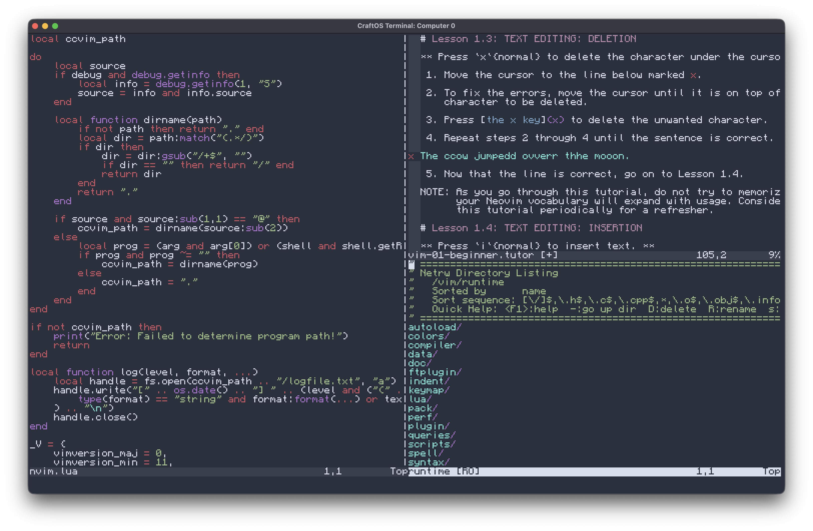

# CCVim

A faithful port of Neovim to Computercraft, built from the ground up to be fully compatible with existing Neovim configs and plugins.

If you're used to Vim or Neovim, you will feel right at home. The only major control difference is that you press &lt;Ctrl-Tab&gt; to exit insert mode instead of &lt;Esc&gt;.

## Features
- **A full Vimscript JIT&rarr;Lua Transpiler** which allows native Vimscript to run without impacting performance
- **Window Splitting** for all your multi-view needs
- **Syntax Highlighting** for over 500 languages utilizing the Neovim highlight plugins with a custom VimRegex VM
- **Plugin Support** for a rapidly growing number of plugins, including:
    - Netrw
    - Lualine
    - oil.nvim
    - NvimTree
    - NeoFS
    - And many more from standard plugin repositories!
- **Neovim API Compatibility** so that any Neovim Lua code should run seamlessly

## NOTICE
This project is still in early beta! I have waited until the project was stable enough to be my main CC editor before releasing it, but you may encounter bugs while you use it.

Not all plugins will run immediately - some require minor edits. I am working on accounting for these, but I cannot guarantee a plugin will not become stuck or crash at a critical point - so use external plugins at your own risk.

## Installation

A pastebin link will be coming as soon as I polish up the installer!

For now, use whatever methods you have to transfer [vim_installer.lua](https://raw.githubusercontent.com/Minater247/CCVim/refs/heads/rewrite-2026/vim_installer.lua) and [instui.lua](https://raw.githubusercontent.com/Minater247/CCVim/refs/heads/rewrite-2026/instui.lua) to your computer, and run `vim_installer`. Currently, the only functional installer option is a fresh install.

Be aware that there are just over 2,000 files to download for a full install, so it may take a while. The final installer, when complete, will allow you to select exactly what you want to download.

## Configuration
You should be able to simply use standard Neovim configuration files! In the directory you install the program to, simply create either `config/init.lua` or `config/init.vim`. Either copy in your config, or write one using the many tutorials available online!

## Plugin Management
Given that ComputerCraft does not support `git` natively, plugins which pull from such providers are not yet supported.

If you are familiar with the `packadd` command, an older method of package management in Vim, that is supported! You may use `runtime/pack`.

Most plugins also work perfectly fine if you simply copy their folders into the `runtime` directory, which is how I have been testing in the meantime.

## Contributing
Please try your config and see if it works! If anything behaves even slightly differently to how Neovim behaves, that is grounds for opening an issue.

If you want to help with development, contributions are welcomed! I will be working on documenting the code properly in the near future as the codebase begins to stabilize.